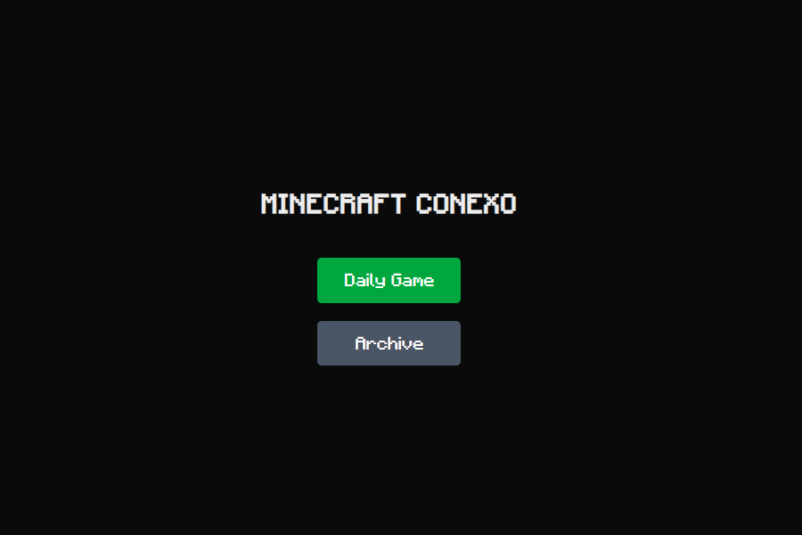
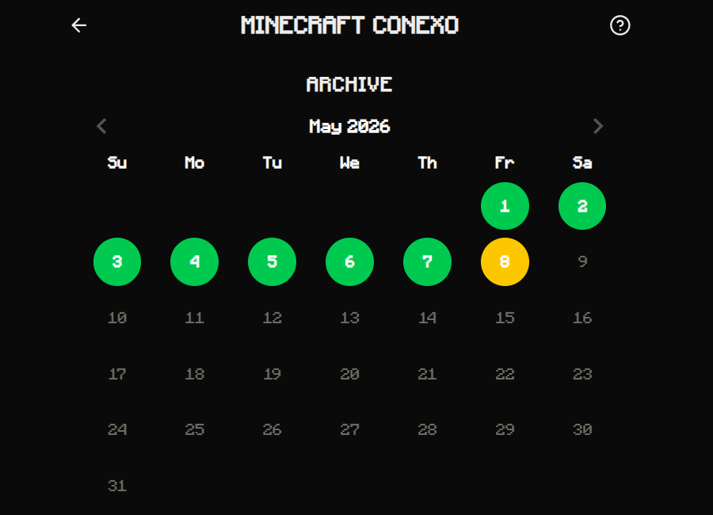
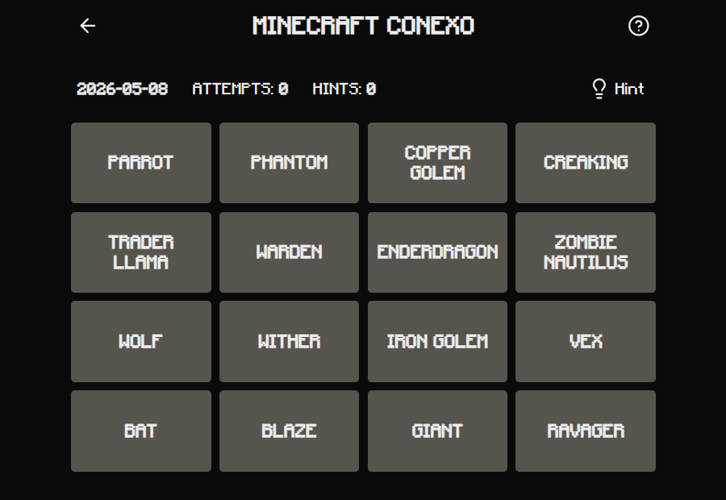
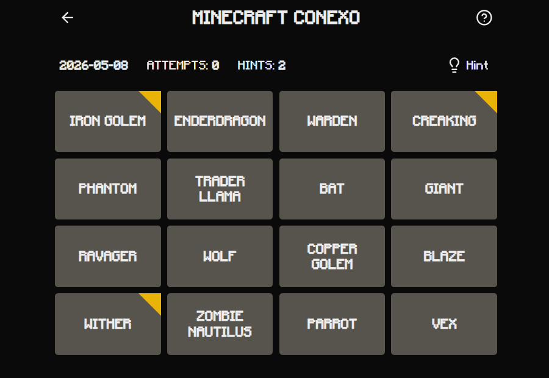
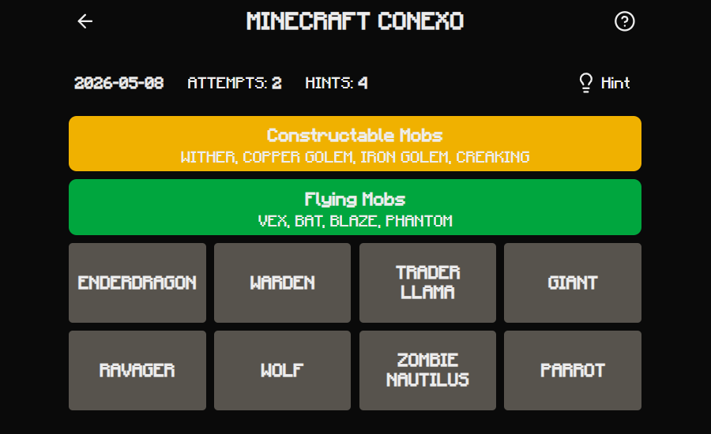
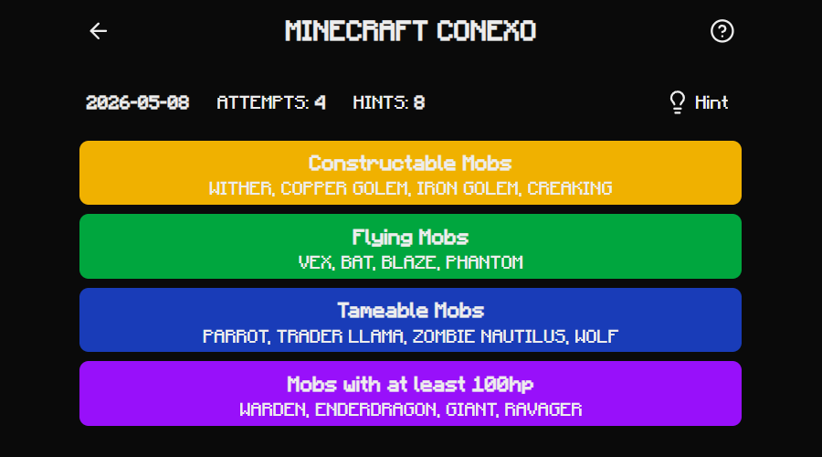

# Minecraft Conexo

A daily Minecraft-themed word-grouping puzzle game — inspired by [Conexo](https://conexo.ws/) and the _Connecting Wall_ segment from BBC's _Only Connect_.

**[▶ Play today's puzzle](https://minecraft-conexo.vercel.app/)**

---

## 🎮 How to Play

You're presented with a **4×4 grid of 16 tiles** — all Minecraft related. Your goal is to find the **4 hidden groups of 4**, where each group shares a hidden correlation.

- Select 4 tiles you think belong together to submit
- No lives — you can try as many times as you want
- The real challenge is finding all groups with **as few attempts and hints as possible**
- A **new puzzle drops every day**, handcrafted with care
- Missed a day? Play any previous puzzle in the **Archive**

### 💡 Hint System

Stuck? Use a hint:

- First hint reveals **2 tiles** that belong to the same group
- Second hint reveals a **3rd related tile** in that group
- Further hints begin revealing tiles from a different group

---

## 📸 Screenshots

### Home Screen



### Archive (Previous Puzzles)



### The Grid



### Hints Revealed



### Group Solved



### Victory Screen



---

## 🛠 Tech Stack

| Layer            | Technology                                    |
| ---------------- | --------------------------------------------- |
| Framework        | [Next.js](https://nextjs.org/)                |
| Language         | [TypeScript](https://www.typescriptlang.org/) |
| Styling          | [Tailwind CSS](https://tailwindcss.com/)      |
| State Management | [Zustand](https://zustand-demo.pmnd.rs/)      |
| Persistence      | localStorage                                  |
| Deployment       | [Vercel](https://vercel.com/)                 |

---

## ✨ Features

- 📅 **Daily puzzle** — new handmade puzzle every day
- 🗂 **Archive** — play all previous puzzles
- 💡 **Progressive hint system** — reveals related tiles one at a time
- 💾 **Progress saved locally** — resume where you left off, even after closing the browser
- 📊 **Stats tracking** — attempts and hints used per puzzle
- 📱 **Fully responsive** — works on desktop and mobile

---

## 🧩 About the Puzzle Format

Each puzzle is handcrafted — every group has a deliberate, Minecraft-specific connection. Groups are designed to have **plausible distractors**: tiles that _seem_ like they fit in multiple groups, making the puzzle genuinely challenging.

Groups are color-coded by difficulty:
🟨 **Yellow** — easiest &nbsp;·&nbsp; 🟩 **Green** &nbsp;·&nbsp; 🟦 **Blue** &nbsp;·&nbsp; 🟪 **Purple** — hardest

The difficulty levels range from straightforward (items from the same biome) to tricky lateral thinking (items that share a hidden or unusual mechanic).

---

## 🚀 Running Locally

```bash
git clone https://github.com/NatanSambato/minecraft-conexo.git
cd minecraft-conexo
npm install
npm run dev
```

Open [http://localhost:3000](http://localhost:3000) in your browser.

---
