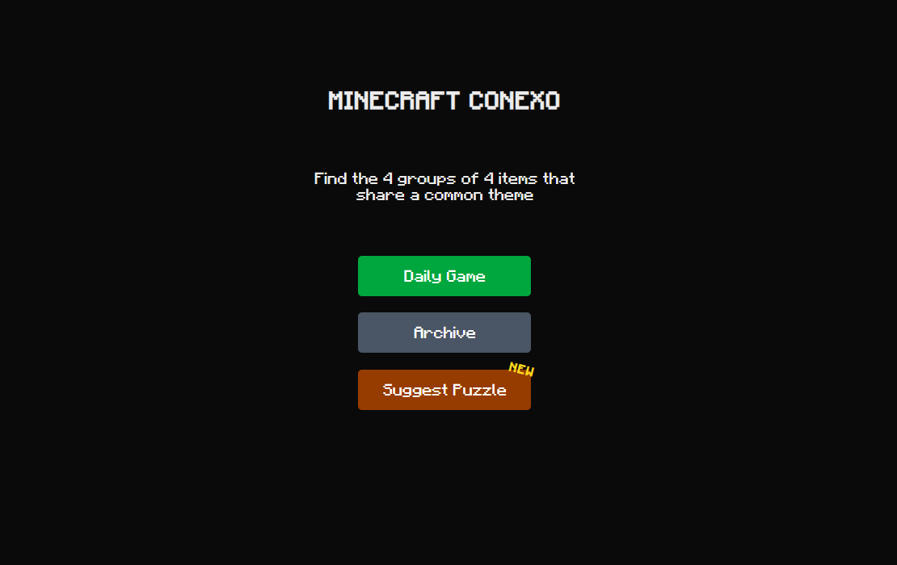
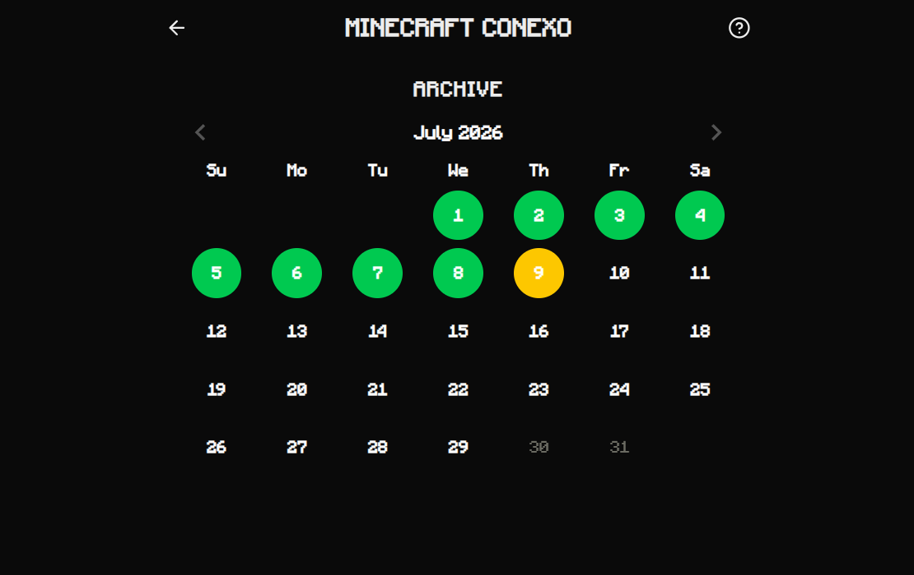
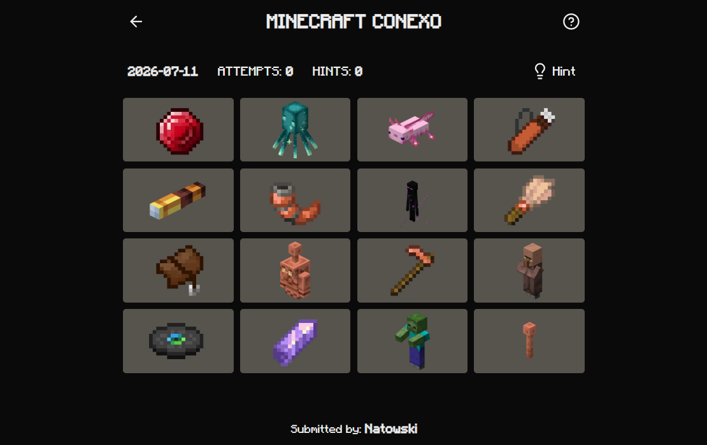
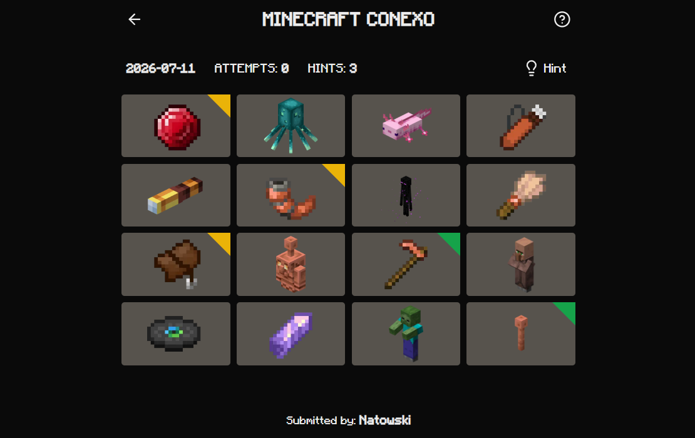
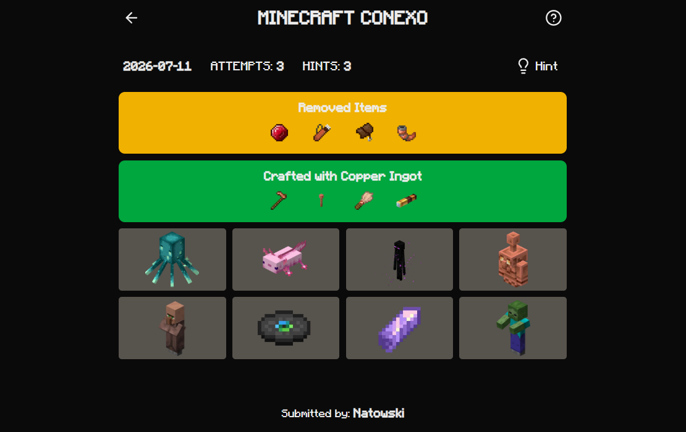
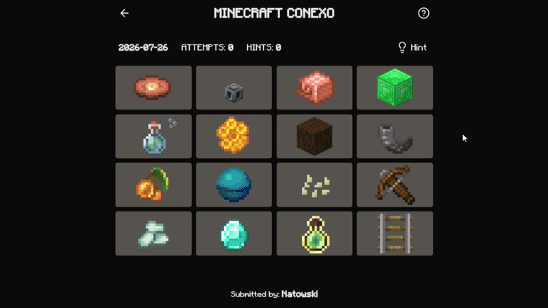
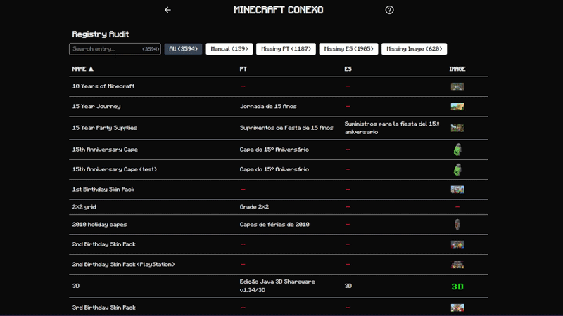
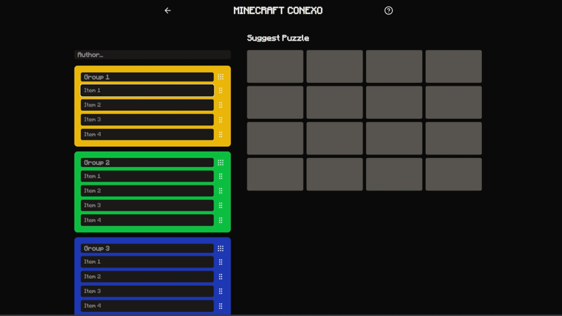
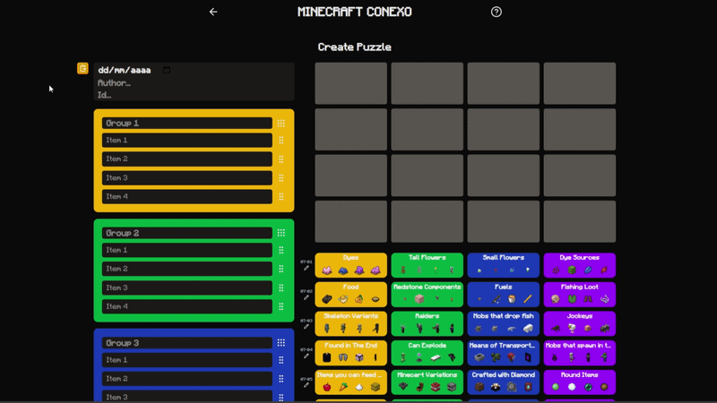

# Minecraft Conexo

A daily Minecraft-themed item-grouping puzzle game — inspired by [Conexo](https://conexo.ws/) and the _Connecting Wall_ segment from BBC's _Only Connect_.

**[▶ Play today's puzzle](https://minecraft-conexo.vercel.app/)**

---

## 🎮 How to Play

You're presented with a **4×4 grid of 16 tiles** — all Minecraft related, each shown with its in-game image. Your goal is to find the **4 hidden groups of 4**, where each group shares a hidden correlation.

- Select 4 tiles you think belong together to submit
- A correct group is revealed immediately
- No lives — you can try as many times as you want
- The real challenge is finding all groups with **as few attempts and hints as possible**

### 💡 Hint System

Stuck? Use a hint:

- First hint reveals **2 tiles** that belong to the same group
- Second hint reveals a **3rd related tile** in that group
- Further hints begin revealing tiles from a different group

---

## 📸 Screenshots & Demos

### Home Screen



### Archive (Previous Puzzles)



### The Grid



### Hints Revealed



### Group Solved



### Item Tooltip



---

## ✨ Features

- 📅 **Daily puzzle** — new handmade puzzle every day
- 🖼️ **Image-based tiles** — every item is rendered with its actual in-game image, sourced from a registry built by crawling the Minecraft Wiki API
- 💡 **Progressive hint system** — reveals related tiles one at a time
- 🏷️ **Item tooltips** — hovering an item shows a Minecraft-styled tooltip with its name
- 🗂 **Archive** — play all previous puzzles
- 💾 **Progress saved locally** — resume where you left off, even after closing the browser
- 📊 **Stats tracking** — attempts and hints used per puzzle
- 📱 **Fully responsive** — works on desktop and mobile
- 🧑‍🤝‍🧑 **Community submissions** — anyone can suggest a puzzle through an in-app builder

---

## 🧩 About the Puzzle Format

Each puzzle is handcrafted — every group has a deliberate, Minecraft-specific connection. Some items act as **tells**: ones so strongly or uniquely tied to a category that they hint at the correct correlation, giving players a signal to lean on. Tells are more common in easier groups; harder groups tend to replace them with items connected by a narrow, lesser-known interaction instead, leaving fewer signals to go on. Items can also be **decoys** — _seeming_ like they fit in multiple groups, designed to mislead.

Beyond individual items, groups themselves are color-coded by difficulty:
🟨 **Yellow** — easiest &nbsp;·&nbsp; 🟩 **Green** &nbsp;·&nbsp; 🟦 **Blue** &nbsp;·&nbsp; 🟪 **Purple** — hardest

The difficulty levels range from straightforward (items from the same biome) to tricky lateral thinking (items that share a hidden or unusual mechanic).

---

## 🛠 Tech Stack

| Layer            | Technology                                    |
| ---------------- | --------------------------------------------- |
| Framework        | [Next.js](https://nextjs.org/)                |
| Language         | [TypeScript](https://www.typescriptlang.org/) |
| API Routes       | Next.js Route Handlers (REST-style)           |
| Styling          | [Tailwind CSS](https://tailwindcss.com/)      |
| State Management | [Zustand](https://zustand-demo.pmnd.rs/)      |
| Drag & Drop      | [dnd kit](https://dndkit.com/)                |
| Persistence      | localStorage                                  |
| Deployment       | [Vercel](https://vercel.com/)                 |

---

## 🖼️ Image Registry

Every item's image comes from a local registry (`registry.json`), built by crawling the [Minecraft Wiki API](https://minecraft.wiki). Entries are maintained by hand through the registry admin page, and any entry can be locked with a `_manual` flag to mark it as a manual override.

For each entry, the registry stores its image URL, its wiki page link, and translated names in Portuguese/Spanish — laid in now to make future localization straightforward, though the game itself is English-only at the moment.

Some items don't have a clean 1:1 in-game icon, so a handful of entries use custom-composited images instead of a raw wiki image — for example, potions and tipped arrows get a small effect-icon overlay so you can tell them apart at a glance, and enchantments (which have no icon in-game at all) use a custom glint-effect graphic paired with a text label.

### Registry Admin

An internal `/admin/registry` page provides a searchable, editable table view of the entire registry, backed by a REST-style API (create/update/delete) — used to audit entries, fix broken images.



---

## ✏️ Suggest & Create a Puzzle

Anyone can submit their own puzzle ideas through a `/suggest` page:

- A **live preview board** renders the tiles as you build the puzzle, so you can see exactly how it'll look before submitting
- Item inputs search the registry directly, with an autocomplete dropdown showing the matched entry's image — unmatched text is still accepted and shown as a placeholder label
- Groups and items can be **drag-reordered**, which also updates each group's difficulty color
- A free-text notes field lets submitters flag anything relevant that won't ship to players (e.g. block variants, edge cases)
- Submissions are sent to a Google Form, which notifies me by email when a new puzzle comes in



The internal `/admin/create` page reuses the same builder, with a few admin-only additions:

- A **date** and optional, auto-incrementing **puzzle ID**
- A **"paste from clipboard"** import that parses a puzzle JSON (e.g., from a [Suggest](#%EF%B8%8F-suggest--create-a-puzzle) submission) straight into the form
- A list of every **previous puzzle's** groups, correlations, and items below the builder — both a quick reference while creating new puzzles and, via one-click shortcuts, to delete or load a puzzle into the form for editing
- Saving writes/updates the puzzle's JSON file on disk through a REST API (create/update/delete) — leaving changes ready for a redeploy without needing manual file edits



---

## 🚀 Running Locally

```bash
git clone https://github.com/NatanSambato/minecraft-conexo.git
cd minecraft-conexo
npm install
npm run dev
```

Open [http://localhost:3000](http://localhost:3000) in your browser.

---
